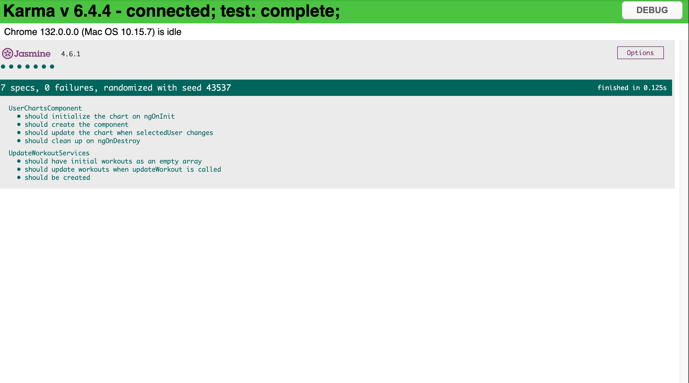

# Health Challenge Tracker

## Overview
An Angular 14+ single-page application (SPA) that allows users to track their workouts by entering their name, workout type, and duration. The application includes search, filter, pagination, and an optional feature to visualize workout progress using charts.

## Features
- Add user workout details (name, type, duration)
- Display workouts in a table
- Search by username
- Filter by workout type
- Pagination for more than 5 users
- Data persistence using `localStorage`
- Unit tests
- Hosted on vercel
- Charts for workout progress

## Installation & Setup
1. Clone the repository:
   ```sh
   git clone https://github.com/Eklavya-sus/HealthChallengeTracker.git
   cd HealthChallengeTracker
   ```
2. Install dependencies:
   ```sh
   npm install
   ```
3. Run the application:
   ```sh
   ng serve
   ```
4. Open `http://localhost:4200` in your browser.

## Tech Stack
- **Angular 14+**
- **Tailwind CSS** (for styling)
- **Angular Material / PrimeNG** (for UI components)
- **LocalStorage** (for data persistence)
- **Chart.js** (for optional workout progress charts)


## Assumptions
- User data is never empty.
- If the user exists and workout type exists → Just update minutes.
- If the user exists but workout type doesn't exist → Add a new workout.
- If the user doesn’t exist → Create a new user entry.

## Edge Cases Solved
- Prevented users from entering empty fields.
- Handled pagination: If the user is on a page beyond available items after filtering, they are redirected to a valid page.
- Managed duplicate user entries appropriately:
  - If the user and workout type exist, only minutes are updated.
  - If the user exists but workout type is new, it is added to the list.
- Ensured search and filter functionalities work together without overriding each other.
- Validated workout minutes to be positive numbers only.

## Testing
- Unit tests using Jasmine & Karma.
- 100% test coverage for one component and one service.


Test---
